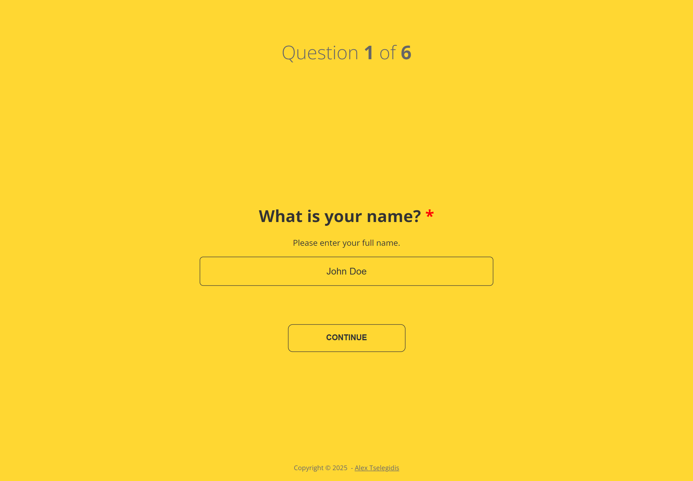

<h1 align="center">
    <br>
        <a href="https://questionful.org">
            
        </a>
        <br>
        <br>
        Questionful
    <br>
</h1>

<h4 align="center">
    Questionnaires Made Simple 
</h4>

<p align="center">
  
  
</p>

<p align="center">
  <a href="#about">About</a> •
  <a href="#setup">Setup</a> •
  <a href="#build">Build</a> •
  <a href="#docker">Docker</a> •
  <a href="#license">License</a>
</p>



## About

Questionful makes creating online questionnaires a breeze.

## Setup

To clone and run this application, you'll need [Git](https://git-scm.com) and [Node.js](https://nodejs.org/en/download/) 
(which comes with [npm](http://npmjs.com)) installed on your computer. From your command line:

```bash
# Clone this repository
$ git clone https://github.com/alextselegidis/questionful.git

# Go into the repository
$ cd questionful

# Install dependencies
$ npm install

# Run the app
$ npm start
```

Note: If you're using Linux Bash for Windows, [see this guide](https://www.howtogeek.com/261575/how-to-run-graphical-linux-desktop-applications-from-windows-10s-bash-shell/) or use `node` from the command prompt.

## Build

To build your online questionnaire you have to add your questions to the 
`src/Questionful.json` file and run the `npm run build` command. 

Your questionnaire files will become available in the `build` directory, 
serve them online! 😊


## Docker

You can run Questionful as a Docker container — ideal for deploying a pre-built questionnaire on your own network.

### Quick Start

```bash
# Build the image (uses the default example config)
./docker/docker-build.sh

# Run the container
docker run -p 8080:80 alextselegidis/questionful
```

Open [http://localhost:8080](http://localhost:8080) to see your questionnaire.

### Custom Questionnaire

Provide your own `Questionful.json` at runtime via a mounted volume:

```bash
docker run -p 8080:80 -v /path/to/config:/config:ro alextselegidis/questionful
```

Or via an environment variable:

```bash
docker run -p 8080:80 -e 'QUESTIONFUL_JSON={...}' alextselegidis/questionful
```

### Publish to Docker Hub

```bash
./docker/docker-build.sh v1.0.0
./docker/docker-publish.sh v1.0.0
```

For the full Docker guide including Docker Compose, networking, and troubleshooting, see [docker.md](docker.md).

## API  Test

To start the fake API server:

npm run fake-server


This will start a lightweight Express server on port 4000, which logs submitted questionnaire data to the console.

When the questionnaire completes, Questionful will automatically send the answers to:

http://localhost:4000/submit


✅ Example console output:

📬 Received questionnaire submission:

```
{
  "answers": [
    { "questionId": 1, "answer": "Yes" },
    { "questionId": 2, "answer": "No" }
  ],
  "submittedAt": "2025-11-07T14:25:00Z"
}
```

You can adjust the port or endpoint inside fake-server.js as needed.

## License 

Code Licensed Under [GPL v3.0](https://www.gnu.org/licenses/gpl-3.0.en.html) | Content Under [CC BY 3.0](https://creativecommons.org/licenses/by/3.0/)

---

Website [alextselegidis.com](https://alextselegidis.com) &nbsp;&middot;&nbsp;
GitHub [alextselegidis](https://github.com/alextselegidis) &nbsp;&middot;&nbsp;
Twitter [@alextselegidis](https://twitter.com/AlexTselegidis)

###### More Projects On Github
###### ⇾ [Easy!Appointments &middot; Open Source Appointment Scheduler](https://github.com/alextselegidis/easyappointments)
###### ⇾ [Plainpad &middot; Self Hosted Note Taking App](https://github.com/alextselegidis/plainpad)
###### ⇾ [Integravy &middot; Service Orchestration At Your Fingertips](https://github.com/alextselegidis/integravy)
